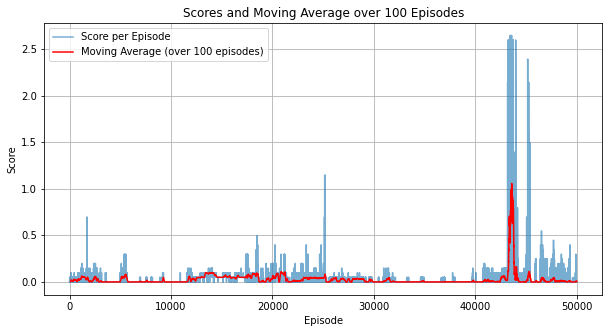

# Table Tennis DRL Implementation

## Overview
In this project, two agents are playing a game of table tennis. Each agent can control a racket and the main goal is to keep a ball in play. The Unity table tennis environment rewards an agent with +0.1 for shooting the ball over the net and punishes the agent with -0.01 for either missing the ball or shooting it out of bounds. The agents perceive the environment through a state space composed of 8 variables, describing the position and velocity of both the racket and the ball.  The agent can move toward and away from the net and jump as well (continuous action space). The environment is considered "solved" if the agents gain an average score of +0.5 over 100 consecutive episodes.

### **2. PPO Algorithm**

In our code, we use the **PPO** algorithm adapted to continuous action spaces. PPO is part of the policy gradient family of **DRL** algorithms. It uses specific mechanisms to update the agent's policy and therefore avoids drastic policy updates. Therefore ensuring stable and efficient learning. Here are the main components of PPO:

1. **Actor-Critic Network:** We use a common feature extractor for both the actor and the critic followed by two heads. The Actor outputs both mean (mu) and standard deviation (std) for the action distribution (Gaussian), while the Critic outputs the state values.
2. **Objective Function:** Usually the standard policy gradient objective leads to large policy updates. PPO can limit the update by using a clipped surrogate objective. By doing so, PPO can generate new policies that do not deviate too much from the older ones.
3. **Advantage Function:** In our implementation, we use Generalized Advantage Estimation (GAE) for advantage computation. 
4. **Optimization:** The model is trained by taking a loss function combining:
   1. The actor's loss. 
   2. The critic's loss (MSE between estimated and actual returns)
   3. Entropy loss (for exploration).

#### **Core Mechanism:**

PPO achieves its stability and efficiency by clipping the policy update to prevent updates that could change the policy too significantly. The objective function is as follows:

$$L^{CLIP} (\theta) = \hat{E}_t [ \min (r_t(\theta) \hat{A}_t, clip(r_t(\theta), 1-\epsilon, 1+\epsilon) \hat{A}_t) ]$$

Where:
- $r_t(\theta)$ is the ratio of the probabilities under the new and old policies. The closer the value to 1, the more drastic the change.
- $\hat{A}_t$ is an estimator of the advantage function at time $t$. The Advantage measures how much better is selected action is compared to the average action given a state.

### **3. Neural Network Architecture:**
For our network architecture, we use feed-forward neural networks for both the actor and critic.
The actor decides the action to take and the citic determines its value.
#### **Shared Feature Extractor:**

- Layers: 2
- Units: firs layer of 128 and a second layer of 64 units.
- Activation: ReLU

We adopt a shared feature extractor to reduce computational. By using a common feature extractor for both actor and critic, we hope to achieve a harmonized understanding of the environment state and encourage feature reuse.

#### **Actor Network:**
- Outputs mean ($\mu$) for the action distribution (Gaussian). The mean represents the most likely action the agent should take.
- A separate learnable log standard deviation ($log\_std$) gives flexibility to the action exploration. 
- The standard deviation is kept always positive. 

#### **Critic Network:**
- Outputs state-value estimates. 
This is a crucial part of the architecture as it provides the actor with the necessary feedback for refining its policy.

### **4. Centralized Learning with Shared Policies**: 
1. **Nature & Goal**: Given that in our environment the agents are actively collaborating to maximize rewards by keeping the ball in play. Therefore, their collaboration pushes them to reduce and prevent costly mistakes like letting the ball hit the ground.
2. **Synchronized Learning**: When using a shared policy, the agents can collectively evolve their strategies. Which could lead to faster convergence to the desired policy. This helps when collaboration is needed.
3. **Efficiency**: Using a single network for both agents, we could reduce significantly the computation footprint. Furthermore,  such a strategy allows for richer training samples when pooling experiences
5. **Potential Limitations**: Shared policies might restrict role differentiation that could be needed in environments with specific role traits.

The nature of the tennis environment is collaborative and well-suited for using centralized learning with shared policies.

### Hyperparameters:

- `gamma`: 0.99 - Discount factor
- `clip_epsilon`: 0.2 - Clip range for PPO's surrogate objective
- `lr`: 1e-4 - Learning rate for the Adam optimizer
- `action_std_bound`: [1e-2, 1.0] - Boundaries for action standard deviation
- `normalize_advantage`: True - If True, advantages are normalized for stability.
- `tau`: 0.95 - GAE hyperparameter
- `value_coef`: 0.5 - Weight for the value loss in the combined loss function
- `entropy_coef`: 0.005 - Weight for the entropy loss in the combined loss function
- `max_norm`: 0.5 - Maximum gradient norm for clipping
- `hidden_units`: [128, 64] - Hidden units for the neural network layers
- `batch_size`: 512 - Number of samples for each training batch

## Plot of Rewards

The agents need to achieve an average score of $+0.5$ (considered over $100$ consecutive episodes) to solve the environment.

From the plot above, it is clear that the learning process is challenging as we were able to solve the environment after **$43579$ episodes**, where we reached a maximum of $1.05$ in the average score over $100$ consecutive episodes. 

## Future Work
While we solve the environment, we can still strive for better performance. For that, we can think of some areas to explore:
1. **Tuning Hyperparameters**: We can explore different sets of hyperparameters such as discount factor, entropy coefficient, or batch size to improve the agent's performance.
2. **Network Architecture**: Experiment with deeper neural networks or batch normalization to achieve better training performance. We can also explore attention mechanisms, for capturing crucial agent interactions.
3. **Alternative Algorithms**: We could exploit other algorithms like Soft Actor-Critic (SAC) or Trust Region Policy Optimization (TRPO).

## Conclusion

In this project, we designed agents capable of collaborating to solve Unity's Table Tennis DRL challenge using the PPO algorithm. The agents were able to solve the environment after 43,579 episodes which attests to the intricacies of multi-agent DRL. While we've had encouraging results, we can still further explore other DRL methods that can push the performance even further. This endeavor solidifies the potential of DRL in managing complex multi-agent scenarios.